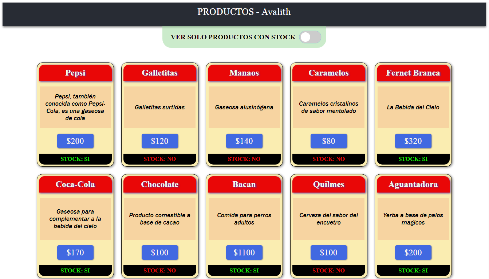
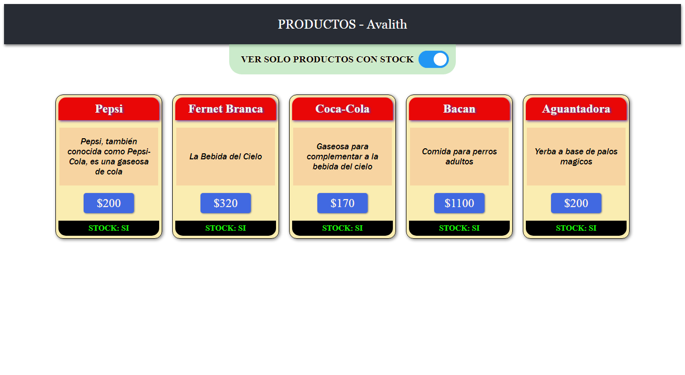

# Getting Started with Create React App

<h3>Ejercicio 1 React Skill Factory</h3>

En base al siguiente array de productos:
```js
[
  { name: 'Pepsi', price: 200, description: 'Pepsi, también conocida como Pepsi-Cola, es una gaseosa de cola', stock: true },
  { name: 'Galletitas', price: 120, description: 'Galletitas surtidas', stock: false },
]
```
Deberan mostrar el catago de productos, para ello deberan crear el componente Catalogo y el componente Producto

Luego debera implementar un Boton para mostrar solo los que estan en stock
Opcional: utilizar un Toggle para mostrar los productos en stock y mostrar todos los productos

Requerimientos:

Utilizar Create React App para generar la aplicacion
No se puede utilizar libreria de terceros
No se puede utilizar typescript
Se valora el uso es eslint
Completar el array de productos con la informacion que deseen respetando las claves dadas.

<h2>RESULTADO DEL DISEÑO Y ESTETICA (2 imagenes):</h2>
<h3> 1 - Todos los Productos:</h3>


<hr>

<h3> 2 - Toggle Activado - Productos con Stock:</h3>
